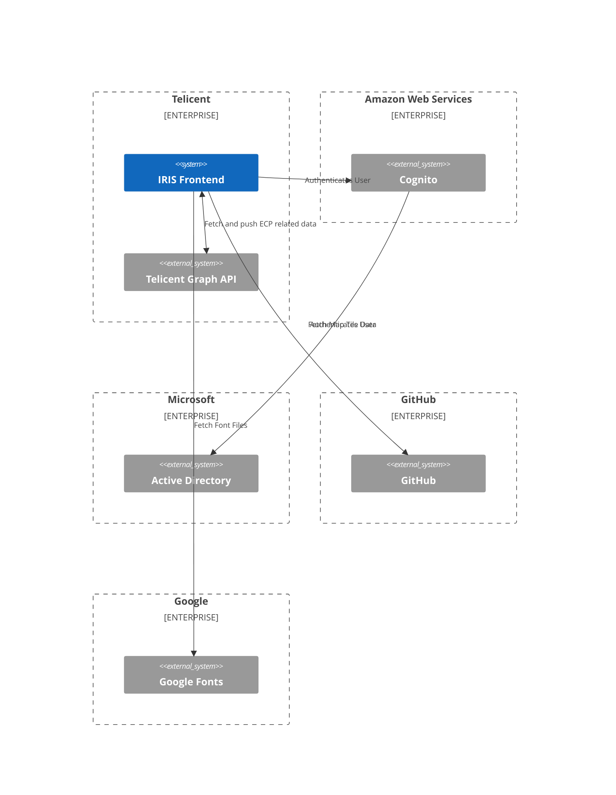
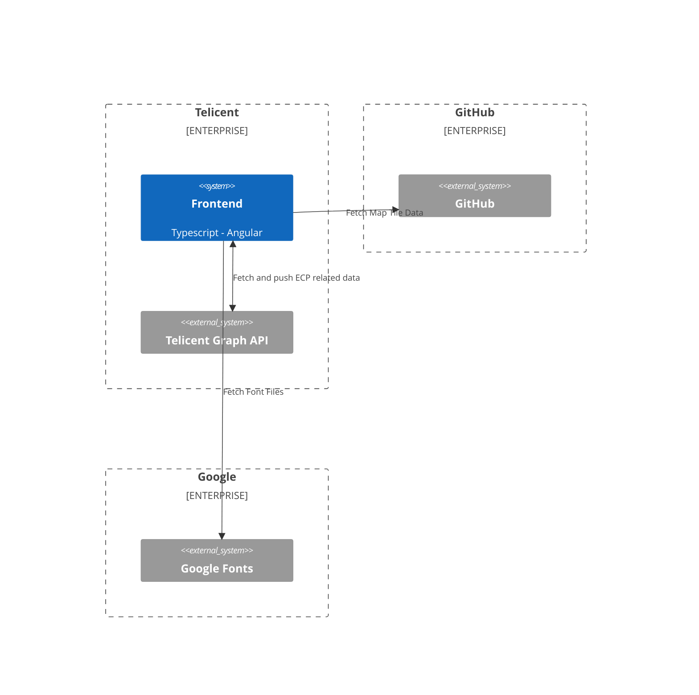
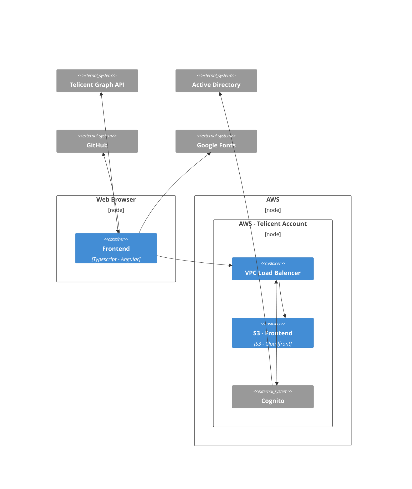

# SCI

> This document describes the System Carbon Intensity (SCI) calculation for the **IRIS** platform's frontend application.

## Overview

**IRIS** enables users to interrogate and engage with information in a way that meets their needs and supports decision-making. It will also support the delivery of better outcomes in relation to retrofit of domestic properties to improve energy efficiency and help address issues which are potentially causing ill-health.

The software carbon intensity (SCI) is a rate of carbon emission per one unit of `R`. The equation for calculating the SCI is as follows:

```
E = Energy consumption
I = Location based marginal carbon emission
M = Embodied emission
R = Functional rate

SCI = ((E * I) + M) / R
```

All the elements in the SCI equation scale by the same function unit of `R`.

## Application Architecture

#### Application Context

The **IRIS** platforms frontend application sits within overall context and interacts with the following external systems:

- **Telicent Graph API**
- **Amazon Cognito**
- **Microsoft Active Directory**
- **GitHub**
- **Google Fonts**



#### Application System Context

The **IRIS Frontend** application consists of the following containers:

- **Frontend**



#### Application Deplotment Context

The **IRIS** platforms frontend application containers are deployed to the follow deploment nodes:

- **Browser - Frontend**
- **S3 - Frontend**



This is replicated across the following environments:

- **DEV**: Development environment
- **PROD**: Production environment

## Software boundary

The **IRIS** platforms frontend appliocation SCI calculation is performed on the following software containers considering the follow deployment nodes and there interactions:

- **Browser - Frontend**
- **Network Traffic**
  - **Bwowser - Frontend** - **Telicent Graph API**
  - **Browser - Frontend** - **GitHub**
  - **Browser - Frontend** - **Google Fonts**

The following deployment nodes and interactions have been excluded due to state constrains:

- **Browser - S3**: Required data and statistics not avaidable from AWS S3 service due to multi-tenacy model of the AWS cloud infrastructure
- Other core AWS account infrastructure
  - AWS IAM
  - CluoudTrail
  - CloudWatch
- All other data center infrastructure and facilities
  - Building
  - Lighting
  - Tempature Control
  - Power
  - Etc...

## Functional Unit

The functional unit for the **IRIS** platform is defined as:

> The energy required to run the **IRIS** platform for 1 user per hour.

## Quantification Method

**Browser - Frontend**

The quantification method used for calculating the `SCI` score is based upon measuring the real power consumption of a standized user device that is running the **Browser - Frontend** node.

The following device is used for this calulation:

```
OEM: Dell
MODEL: Latitude 7390
OS: Linux 6.1.82 nixos 23.11.20240326.4473351 (tapir) x86_64  GNU/Linux
```

`E` - Energy

The following methodology has been choosen and followed to calulate the energy consumption of the **Browser - Frontend** node due to the nature of the use case of the **IRIS** platform.

1. Build the **Browser - Frontend** node for PRODUCTION
2. Run a http server to serve the **Browser - Frontend** node locally
3. Take a idea power reading of the device
4. Run the **Browser - Frontend** node within the chromium browser while taking another power reading

This methodology can be replicated using `nix run github:arup-group/C477-DBT_Vis#sci`.

We can then calucate the energy consumption with the following calulation:

```
IP = Idle Power in Watts
AP = Active Power in Watts
P  = Power in Kilowatts
E  = Energy in Kilowatt Hours

P  = (AP - IP) / 1000
E  = P
```

`I` - Carbon Intensity

The **IRIS** platform is aimed at users located in the United Kingdom. We therefore use the carbon intensity value for Great Britain, this is obtained from the [Electricity Map](https://app.electricitymaps.com/zone/GB?solar=false&remote=true&wind=false) web application.

`M` - Embodied

Considering a 4 year device lifespace, Dell [reports](https://i.dell.com/sites/csdocuments/CorpComm_Docs/en/carbon-footprint-latitude-7390.pdf) that the latitude 7390 emits `222 kgC02e` of emboided carbon during its manufacturing processs.

If we assume that the user is not multi tasking we can calucate the embodied carbon with the following calulation:

```
H  = 35064 hours (4 years)
TM = 222 kgC02e

M  = TM / H
M  = 222 / 34064
M  = 0.00651714419 kgC02e
```

## SCI Calculations

#### 28/03/2024

**Brower - Frontend**

Results from running the `nix run github:arup-group/C477-DBT_Vis#sci` command:

```
powerstat-inactive.log

Running for 60.0 seconds (30 samples at 2.0 second intervals).
Power measurements will start in 0 seconds time.

  Time    User  Nice   Sys  Idle    IO  Run Ctxt/s  IRQ/s Fork Exec Exit  Watts  uncore  pkg-0   core   dram   psys  CPU Freq  Freq Min  Freq Max
10:35:18   0.1   0.0   0.0  99.9   0.0    1    311    284    0    0    0   9.23    0.00   2.13   0.18   0.72   6.20  0.69 GHz  0.40 GHz  3.60 GHz
10:35:20   0.2   0.0   0.1  99.7   0.0    1    404    307    0    0    0   9.78    0.00   2.33   0.37   0.73   6.35  0.69 GHz  0.40 GHz  3.61 GHz
10:35:22   0.1   0.0   0.1  99.8   0.1    1    329    234    0    0    0   9.28    0.00   2.15   0.21   0.73   6.20  0.53 GHz  0.40 GHz  3.60 GHz
10:35:24   0.1   0.0   0.0  99.9   0.0    1    350    266    0    0    0   9.22    0.00   2.13   0.18   0.73   6.19  0.53 GHz  0.40 GHz  3.60 GHz
10:35:26   0.3   0.0   0.1  99.6   0.0    1    366    345    0    0    0   9.83    0.00   2.36   0.40   0.73   6.34  0.69 GHz  0.40 GHz  3.60 GHz
10:35:28   0.1   0.0   0.1  99.8   0.1    1    374    246    2    0    2   9.16    0.00   2.12   0.16   0.72   6.15  0.91 GHz  0.40 GHz  3.60 GHz
10:35:30   0.0   0.0   0.0 100.0   0.0    1    332    229    0    0    0   9.09    0.00   2.10   0.15   0.72   6.11  0.53 GHz  0.40 GHz  3.60 GHz
10:35:32   0.2   0.0   0.1  99.7   0.0    1    327    258    0    0    0   9.67    0.00   2.31   0.35   0.73   6.28  0.68 GHz  0.40 GHz  3.60 GHz
10:35:34   0.1   0.0   0.0  99.9   0.1    1    321    258    0    0    0   9.22    0.00   2.15   0.20   0.73   6.15  0.69 GHz  0.40 GHz  3.60 GHz
10:35:36   0.1   0.0   0.1  99.9   0.0    1    462    328    2    0    2   9.39    0.00   2.21   0.25   0.73   6.19  0.53 GHz  0.40 GHz  3.60 GHz
10:35:38   0.3   0.0   0.1  99.6   0.0    1    325    277    0    0    0   9.84    0.00   2.37   0.41   0.73   6.32  0.53 GHz  0.40 GHz  3.60 GHz
10:35:40   0.0   0.0   0.1  99.9   0.1    1    318    246    0    0    0   9.12    0.00   2.11   0.16   0.72   6.13  0.62 GHz  0.40 GHz  3.60 GHz
10:35:42   0.1   0.0   0.1  99.9   0.0    1    300    212    0    0    0   9.10    0.00   2.11   0.16   0.72   6.10  0.63 GHz  0.40 GHz  3.60 GHz
10:35:44   0.2   0.0   0.1  99.7   0.1    1    336    286    0    0    0   9.71    0.00   2.32   0.36   0.73   6.29  0.53 GHz  0.40 GHz  3.60 GHz
10:35:46   0.1   0.0   0.1  99.9   0.0    1    374    291    0    0    0   9.20    0.00   2.14   0.19   0.72   6.14  0.53 GHz  0.40 GHz  3.60 GHz
10:35:48   0.1   0.0   0.1  99.9   0.0    1    286    180    0    0    0   9.01    0.00   2.09   0.14   0.72   6.07  0.69 GHz  0.40 GHz  3.60 GHz
10:35:50   0.2   0.0   0.1  99.7   0.0    1    289    254    0    0    0   9.61    0.00   2.30   0.34   0.73   6.25  0.69 GHz  0.40 GHz  3.60 GHz
10:35:52   0.1   0.0   0.0  99.9   0.0    1    316    204    0    0    0   9.01    0.00   2.08   0.13   0.72   6.08  0.53 GHz  0.40 GHz  3.60 GHz
10:35:54   0.1   0.0   0.1  99.8   0.1    1    336    261    0    0    0   9.15    0.00   2.12   0.17   0.72   6.13  0.69 GHz  0.40 GHz  3.60 GHz
10:35:56   0.3   0.0   0.1  99.6   0.0    1    382    349    0    0    0   9.77    0.00   2.35   0.39   0.73   6.31  0.69 GHz  0.40 GHz  3.60 GHz
10:35:58   0.0   0.0   0.0 100.0   0.0    1    338    242    0    0    0   9.08    0.00   2.11   0.16   0.72   6.09  0.91 GHz  0.40 GHz  3.60 GHz
10:36:00   0.1   0.0   0.1  99.9   0.0    1    332    229    0    0    0   9.11    0.00   2.11   0.16   0.72   6.11  0.69 GHz  0.40 GHz  3.60 GHz
10:36:02   0.3   0.0   0.1  99.7   0.0    1    344    280    0    0    0   9.69    0.00   2.32   0.36   0.73   6.28  0.69 GHz  0.40 GHz  3.60 GHz
10:36:04   0.1   0.0   0.1  99.8   0.1    1    309    222    0    0    0   9.07    0.00   2.10   0.15   0.72   6.09  0.69 GHz  0.40 GHz  3.60 GHz
10:36:06   0.1   0.0   0.1  99.9   0.0    1    380    300    0    0    0   9.20    0.00   2.15   0.20   0.72   6.13  1.20 GHz  0.40 GHz  3.60 GHz
10:36:08   0.2   0.0   0.1  99.7   0.0    1    310    251    0    0    0   9.68    0.00   2.31   0.36   0.73   6.28  0.53 GHz  0.40 GHz  3.60 GHz
10:36:10   0.1   0.0   0.0  99.9   0.0    1    288    186    0    0    0   9.02    0.00   2.08   0.14   0.72   6.08  0.53 GHz  0.40 GHz  3.60 GHz
10:36:12   0.1   0.0   0.1  99.7   0.0    1    310    267    1    1    1   9.42    0.00   2.22   0.27   0.73   6.19  0.69 GHz  0.40 GHz  3.60 GHz
10:36:14   0.3   0.0   0.1  99.7   0.0    1    350    288    0    0    0   9.71    0.00   2.32   0.37   0.73   6.29  0.69 GHz  0.40 GHz  3.60 GHz
10:36:16   0.1   0.0   0.1  99.8   0.1    1    412    318    0    0    0   9.31    0.00   2.18   0.23   0.72   6.17  0.53 GHz  0.40 GHz  3.60 GHz
-------- ----- ----- ----- ----- ----- ---- ------ ------ ---- ---- ---- ------  ------ ------ ------ ------ ------ --------- --------- ---------
 Average   0.1   0.0   0.1  99.8   0.0  1.0  340.4  263.2  0.2  0.0  0.2   9.36    0.00   2.20   0.24   0.73   6.19  0.66 GHz  0.40 GHz  3.60 GHz
 GeoMean   0.0   0.0   0.0  99.8   0.0  1.0  338.3  259.9  0.0  0.0  0.0   9.35    0.00   2.19   0.23   0.73   6.19  0.64 GHz  0.40 GHz  3.60 GHz
  StdDev   0.1   0.0   0.0   0.1   0.0  0.0   39.1   41.9  0.5  0.2  0.5   0.28    0.00   0.10   0.10   0.00   0.09  0.15 GHz   N/A       1.00 MHz
-------- ----- ----- ----- ----- ----- ---- ------ ------ ---- ---- ---- ------  ------ ------ ------ ------ ------ --------- --------- ---------
 Minimum   0.0   0.0   0.0  99.6   0.0  1.0  286.0  180.0  0.0  0.0  0.0   9.01    0.00   2.08   0.13   0.72   6.07  0.53 GHz  0.40 GHz  3.60 GHz
 Maximum   0.3   0.0   0.1 100.0   0.1  1.0  461.5  349.0  2.0  1.0  2.0   9.84    0.00   2.37   0.41   0.73   6.35  1.20 GHz  0.40 GHz  3.61 GHz
-------- ----- ----- ----- ----- ----- ---- ------ ------ ---- ---- ---- ------  ------ ------ ------ ------ ------ --------- --------- ---------
Summary:
CPU:   9.36 Watts on average with standard deviation 0.28
Note: power read from RAPL domains: uncore, pkg-0, core, dram, psys.
These readings do not cover all the hardware in this device.

C-State    Resident      Count Latency
C10         98.295%       9421     890
C9           0.014%         46     480
C8           0.539%       2711     200
C7s          0.002%          7     124
C6           0.376%       2454      85
C3           0.010%        472      70
C1E          0.095%       1788      10
C1           0.015%        298       2
POLL         0.000%         42       0
C0           0.654%

Histogram (of 30 power measurements)

 Range (Watts)  Count
 9.013 -  9.094     6 ########################################
 9.095 -  9.177     5 #################################
 9.178 -  9.260     5 #################################
 9.261 -  9.343     2 #############
 9.344 -  9.426     2 #############
 9.427 -  9.509     0
 9.510 -  9.591     0
 9.592 -  9.674     2 #############
 9.675 -  9.757     4 ##########################
 9.758 -  9.840     4 ##########################

Histogram (of 30 CPU utilization measurements)

Range (%CPU)  Count
0.000 - 0.043     2 ##########
0.044 - 0.087     4 ####################
0.088 - 0.130     8 ########################################
0.131 - 0.174     0
0.175 - 0.218     5 #########################
0.219 - 0.262     1 #####
0.263 - 0.305     0
0.306 - 0.349     7 ###################################
0.350 - 0.393     2 ##########
0.394 - 0.437     1 #####

Histogram (of 30 CPU average frequencies)

Range (GHz)   Count
0.526 - 0.593    11 ###############################
0.594 - 0.660     2 #####
0.661 - 0.728    14 ########################################
0.729 - 0.795     0
0.796 - 0.862     0
0.863 - 0.930     2 #####
0.931 - 0.997     0
0.998 - 1.064     0
1.065 - 1.132     0
1.133 - 1.199     1 ##
```

```
powerstat-active.log

Running for 60.0 seconds (30 samples at 2.0 second intervals).
Power measurements will start in 0 seconds time.

  Time    User  Nice   Sys  Idle    IO  Run Ctxt/s  IRQ/s Fork Exec Exit  Watts  uncore  pkg-0   core   dram   psys  CPU Freq  Freq Min  Freq Max
10:29:08   0.2   0.0   0.1  99.6   0.0    1    322    316    0    0    0  10.16    0.00   2.43   0.42   0.74   6.57  0.40 GHz  0.40 GHz  0.40 GHz
10:29:10   6.2   0.0   0.6  93.2   0.1    4   3145   2258    1    0    0  20.14    0.59   5.79   3.06   1.10   9.62  3.09 GHz  2.49 GHz  3.43 GHz
10:29:12  47.5   0.0   2.4  50.0   0.1    2   8503  11904    0    0    0  61.55    0.99  20.03  16.50   2.27  21.77  3.05 GHz  2.90 GHz  3.45 GHz
10:29:14  44.0   0.0   2.2  53.7   0.1    2   7746  11781    0    0    0  63.78    0.48  20.99  18.04   1.95  22.31  3.09 GHz  2.57 GHz  3.49 GHz
10:29:16  44.2   0.0   2.2  53.6   0.0    5   7706  11971    0    0    0  63.29    0.63  20.80  17.67   2.03  22.16  2.25 GHz  2.20 GHz  2.32 GHz
10:29:18  33.3   0.0   1.6  65.1   0.0    2   5605   8241    0    0    0  56.81    0.55  18.66  15.70   1.69  20.22  1.55 GHz  0.40 GHz  3.60 GHz
10:29:20  48.6   0.0   2.6  48.7   0.1   10   8080  14198    1    0    0  65.87    0.71  21.64  18.38   2.19  22.95  3.03 GHz  3.03 GHz  3.03 GHz
10:29:22  48.0   0.0   2.8  49.1   0.2    6   9046  12085    0    0    0  62.18    0.83  20.32  16.95   2.13  21.95  3.28 GHz  3.21 GHz  3.32 GHz
10:29:24  43.9   0.0   2.6  53.4   0.1    3   8530  10959    0    0    0  63.36    0.92  20.75  17.31   2.10  22.29  2.58 GHz  2.20 GHz  3.52 GHz
10:29:26  29.4   0.0   1.9  68.7   0.0    2   9329   8532    1    0    0  52.42    2.08  16.68  12.05   2.19  19.41  3.30 GHz  2.92 GHz  3.60 GHz
10:29:28  40.2   0.0   2.6  57.2   0.0    5   9026  11252    0    0    0  58.54    1.05  18.99  15.41   2.14  20.96  2.48 GHz  2.25 GHz  2.72 GHz
10:29:30  35.6   0.0   2.5  61.9   0.1    3  10180  10612    0    0    0  57.28    1.95  18.39  13.87   2.30  20.77  3.12 GHz  2.89 GHz  3.58 GHz
10:29:32  38.7   0.0   2.1  59.2   0.1    2   7984  11464    0    0    0  59.62    0.97  19.42  15.92   2.08  21.23  1.58 GHz  0.40 GHz  3.61 GHz
10:29:34  50.4   0.0   2.5  47.1   0.0    4   8586  12922    0    0    0  65.68    0.84  21.51  18.10   2.27  22.97  2.45 GHz  2.10 GHz  3.27 GHz
10:29:36  31.4   0.0   2.0  66.5   0.1    9   9131   9003    2    0    2  57.30    1.51  18.53  14.49   2.12  20.65  2.90 GHz  2.90 GHz  2.90 GHz
10:29:38  33.9   0.0   2.5  63.6   0.1    2  10282  10894    0    0    2  57.54    2.00  18.44  13.83   2.40  20.87  2.65 GHz  2.29 GHz  3.12 GHz
10:29:40  12.1   0.0   1.3  86.6   0.0    1   6917   4600    0    0    0  32.93    2.06   9.87   5.41   1.83  13.75  0.40 GHz  0.40 GHz  0.40 GHz
10:29:42  16.6   0.0   1.2  82.1   0.1   11   3810   4550    0    0    0  27.79    0.55   8.34   5.53   1.42  11.95  3.17 GHz  3.17 GHz  3.17 GHz
10:29:44  12.8   0.0   0.9  86.3   0.0    3   4337   3978    0    0    0  32.38    0.77  10.00   6.96   1.37  13.28  2.30 GHz  0.40 GHz  3.45 GHz
10:29:46  39.9   0.0   2.6  56.9   0.6    5  10144  10017    1    0    0  57.29    1.48  18.33  14.27   2.36  20.85  2.65 GHz  2.42 GHz  3.54 GHz
10:29:48  31.4   0.0   2.2  66.2   0.1    1   8600   8480    0    0    0  57.01    1.73  18.29  14.01   2.15  20.83  1.86 GHz  0.40 GHz  3.54 GHz
10:29:50  32.6   0.0   2.1  64.8   0.4    7   7869   9372    0    0    0  54.28    1.26  17.21  13.46   2.01  20.35  2.99 GHz  2.77 GHz  3.30 GHz
10:29:52  38.1   0.0   2.0  59.9   0.0    2   7596   9566    0    0    0  61.18    1.31  19.64  15.82   2.06  22.35  2.66 GHz  2.38 GHz  3.35 GHz
10:29:54  18.1   0.0   1.8  79.5   0.5    5   8082   5874    0    0    2  46.08    1.99  14.24   9.77   1.91  18.18  2.94 GHz  2.50 GHz  3.44 GHz
10:29:56  43.9   0.0   2.6  53.0   0.5    3   9578  13422    0    0    0  62.17    1.17  19.91  16.17   2.28  22.65  3.24 GHz  3.09 GHz  3.47 GHz
10:29:58  41.5   0.0   2.5  55.4   0.6    2   9920  12040    0    0    0  61.84    1.21  19.77  15.98   2.28  22.59  3.00 GHz  2.81 GHz  3.39 GHz
10:30:00  44.8   0.0   3.4  51.6   0.3   11  11005  13294    0    0    0  62.00    1.51  19.73  15.59   2.48  22.69  3.09 GHz  2.94 GHz  3.45 GHz
10:30:02  52.8   0.0   3.7  43.5   0.0    3   9986  17135    1    1    1  65.01    1.45  20.95  16.86   2.60  23.16  3.04 GHz  2.88 GHz  3.30 GHz
10:30:04  24.8   0.0   2.5  72.3   0.3    5  11461   8839    0    0    0  53.35    2.92  16.50  10.94   2.53  20.46  2.31 GHz  2.29 GHz  2.33 GHz
10:30:06  24.5   0.0   2.3  71.9   1.4    2   9062  10692    0    0    0  44.82    1.52  13.75   9.73   2.03  17.79  2.70 GHz  0.40 GHz  3.60 GHz
-------- ----- ----- ----- ----- ----- ---- ------ ------ ---- ---- ---- ------  ------ ------ ------ ------ ------ --------- --------- ---------
 Average  33.6   0.0   2.1  64.0   0.2  4.1 8052.2 9675.0  0.2  0.0  0.2  53.12    1.23  17.00  13.27   2.03  19.59  2.57 GHz  2.13 GHz  3.10 GHz
 GeoMean  26.9   0.0   1.9  62.6   0.0  3.3 7196.6 8287.0  0.0  0.0  0.0  50.00    0.00  15.77  11.41   1.98  18.94  2.36 GHz  1.70 GHz  2.85 GHz
  StdDev  13.6   0.0   0.7  14.2   0.3  2.9 2407.7 3643.7  0.5  0.2  0.6  14.08    0.62   4.85   4.68   0.41   4.17  0.74 GHz  1.00 GHz  0.79 GHz
-------- ----- ----- ----- ----- ----- ---- ------ ------ ---- ---- ---- ------  ------ ------ ------ ------ ------ --------- --------- ---------
 Minimum   0.2   0.0   0.1  43.5   0.0  1.0  322.0  316.5  0.0  0.0  0.0  10.16    0.00   2.43   0.42   0.74   6.57  0.40 GHz  0.40 GHz  0.40 GHz
 Maximum  52.8   0.0   3.7  99.6   1.4 11.0 11461.0 17135.0  2.0  1.0  2.0  65.87    2.92  21.64  18.38   2.60  23.16  3.30 GHz  3.21 GHz  3.61 GHz
-------- ----- ----- ----- ----- ----- ---- ------ ------ ---- ---- ---- ------  ------ ------ ------ ------ ------ --------- --------- ---------
Summary:
CPU:  53.12 Watts on average with standard deviation 14.08
Note: power read from RAPL domains: uncore, pkg-0, core, dram, psys.
These readings do not cover all the hardware in this device.

C-State    Resident      Count Latency
C10         39.408%     100739     890
C9           1.348%       4281     480
C8          11.967%      82486     200
C7s          0.023%        113     124
C6           9.057%     103703      85
C3           0.614%      25987      70
C1E          0.615%      23972      10
C1           0.399%      13847       2
POLL         0.003%        535       0
C0          36.567%

Histogram (of 30 power measurements)

 Range (Watts)  Count
10.156 - 15.726     1 ###
15.727 - 21.298     1 ###
21.299 - 26.869     0
26.870 - 32.441     2 ######
32.442 - 38.013     1 ###
38.014 - 43.584     0
43.585 - 49.156     2 ######
49.157 - 54.727     3 ##########
54.728 - 60.299     8 ##########################
60.300 - 65.870    12 ########################################

Histogram (of 30 CPU utilization measurements)

 Range (%CPU)   Count
 0.375 -  5.988     1 ######
 5.989 - 11.602     1 ######
11.603 - 17.216     2 #############
17.217 - 22.829     2 #############
22.830 - 28.443     2 #############
28.444 - 34.057     3 ####################
34.058 - 39.671     4 ##########################
39.672 - 45.285     5 #################################
45.286 - 50.899     6 ########################################
50.900 - 56.513     4 ##########################

Histogram (of 30 CPU average frequencies)

Range (GHz)   Count
0.400 - 0.689     2 #######
0.690 - 0.978     0
0.979 - 1.268     0
1.269 - 1.558     1 ###
1.559 - 1.848     1 ###
1.849 - 2.137     1 ###
2.138 - 2.427     3 ##########
2.428 - 2.717     7 #########################
2.718 - 3.006     4 ##############
3.007 - 3.296    11 ########################################
```

```
IP = 9.6 Watts
AP = 53.12 Watts
T  = 60 seconds

P  = (AP - IP) / 1000
   = (53.12 - 9.6) / 1000
   = 0.04352 Kilowatts

E  = P
E  = 0.04352 Kilowatts

I = 205 gC02eq/kWh

M = 0.00651714419

SCI = (E * I) + M
    = (0.04352 * 205) + 0.00651714419
    = 8.9224 + 0.00651714419
    = 8.92891714419
```

**IRIS**

```
R = 1 (1 user per one hour of platform use)

Browser - Frontend = 8.92891714419

SCI = R * Browser - Frontend
    = 1 * 8.92891714419
    = 8.92891714419
```
